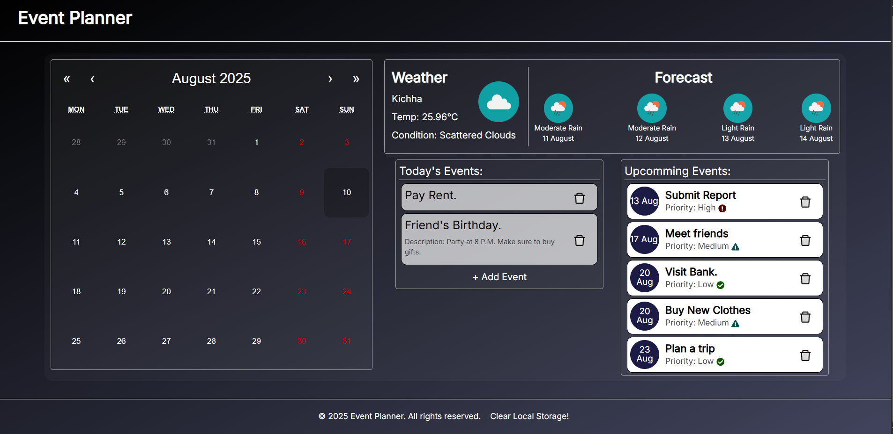

# 📅 Smart Daily Planner

A React-based personal planner that combines a **calendar**, **event manager**, and **real-time weather updates** into one beautifully designed dashboard. Plan your days, manage your events, and stay updated with the weather — all in one place!

---

## 🖼️ Demo

> 📌 https://eventplanner-prashant.netlify.app/)

---

## 📸 Screenshot

### 🏠 Home Page



---

## 🚀 Features

### 🗓️ Calendar
- Monthly calendar view
- Highlights current day
- Click any date to add or view events

### 📌 Event Planner
- Add, view, and delete events
- Supports multiple events per day
- Events saved in localStorage

### 🌤️ Weather Integration
- Shows current and 4-day forecast
- Auto location via browser 
- Data from OpenWeatherMap API

### 🎨 UI & UX
- Clean responsive layout
- Compatible for mobile view
- Built with Tailwind CSS / Bootstrap

---

## 🛠️ Tech Stack

| Feature         | Technology Used               |
|-----------------|-------------------------------|
| Framework       | React.js                      |
| Styling         | Tailwind CSS or Bootstrap     |
| Calendar        | `react-calendar`              |
| State Handling  | React Hooks, useContext       |
| API Integration | OpenWeatherMap API            |
| Storage         | localStorage (for now)        |
| Icons           | ReactIcons                    |

---

## ⚙️ Setup & Installation

Make sure you have **Node.js** and **npm** installed.

```bash
# 1. Clone the repository
git clone https://github.com/your-username/smart-daily-planner.git

# 2. Navigate into the project directory
cd smart-daily-planner

# 3. Install dependencies
npm install

# 4. Start the development server
npm run dev
```
